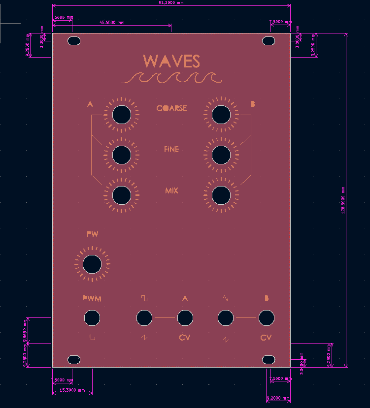

# WAVES VCO 

PCB and Front Pannel designed by me based off the [Mortiz Klein Shapes VCO](https://www.youtube.com/c/MoritzKlein0). This designs blends some of the presented ideas to make the oscillator I wanted.

## Features
- **EURORACK** compatible. 100KOhm output and 1KOhm input impedances. Compatible with eurorack sizes standard (128.5mm (3U) x 18HP).
- Two oscillators with independent CV and outputs.
  - **OSC-A** can output a saw and a square wave which can be mixed toghether. The square wave duty cycle can be modulated either by hand or with an external control voltage.  
  - **OSC-B** can output a saw and a traingular wave which can be mixed toghether. 
- Control voltage up to 5V @ 1V/oct.

## Components

Full list of components needed is included in the VCO.csv file. 

### Potentiometers
- Trimmers are vertical.
- Potentiometers are Vertical Alpha 9mmm. 
- Jack sockets are PJ301M-12.

## Tunning 

The tunning of each channel is done with a trim pot accesible in the bakc + COARSE and FINE knobs in the front. Personally I recommend using some voltage generator that can output 2 values of 0V and 5V in order to adjust the top and bottom range. As the VCO is 5V @ 1v/oct 0V sould be 5 octaves apart from 5V. Use the the potentiometers in the front (mainly the COARSE one) to move the lowest note (0V CV) to a C, then use the trimmer to rise the top note to a C, when needed use the fine pot to make smaller adjustments. This process is a bit tedious and it mainly consists of back and forward between the potentiometers but it ends up working.

- For **CHANNEL A** back trimmer is **RV6**.
- For **CHANNEL B** back trimmer is **RV5**.

### Triangular wave adjustment

In order to make the triangular wave work correctly some offset has to be adjusted, this is easier to do if you have an oscilloscope to check the waveform. The trimpot for this adjustment is **RV9**.
